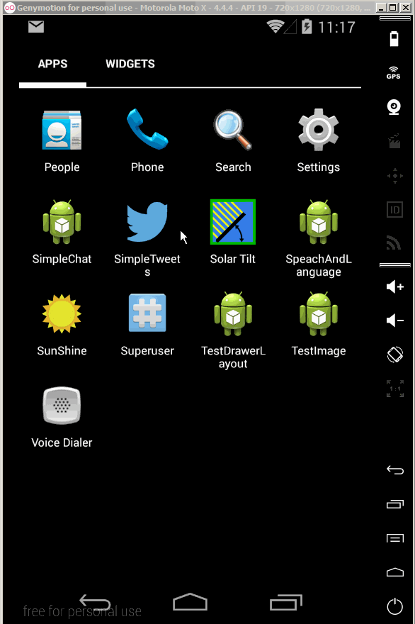

# Simple Tweets app.

Time spent: 20 hours

Completed user stories

* [x] User can sign into twitter using OAuth login.
* [x] User can view tweets from their home timeline.
      * [x] User is shown username, name, and body of each tweet.
      * [x] User is shown a relative timestamp.
      * [x] User can view more tweets as they scroll with endless pagination.
      * [x] Optional: Links in tweets are clickable and will launch the web browser.
* [x] User can compose a new tweet:
      * [x] User can click a "Compose" icon the the Action Bar on the top right.
      * [x] User can enter a new tweet and post this to twitter.
      * [x] User is taken back to home timeline with new tweet visible in timeline.
      * [x] Optional: User can see a counter with total number of characters left for tweet.

WalkThrough

